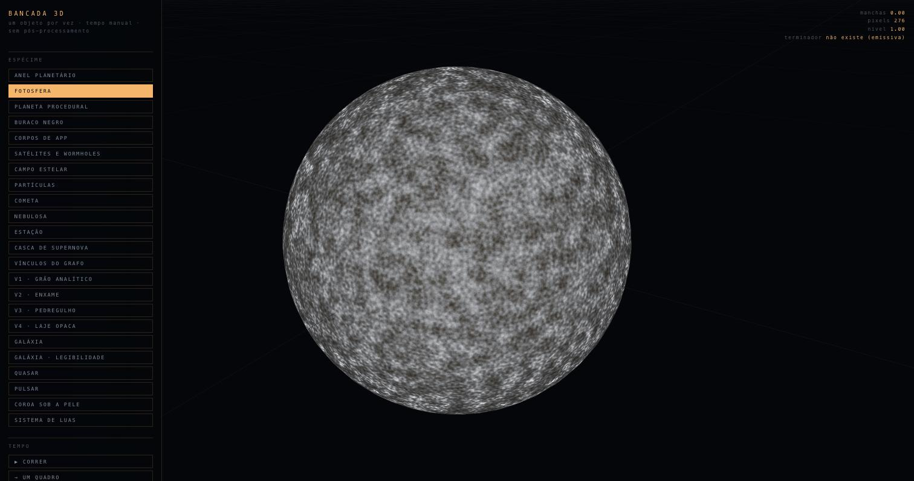
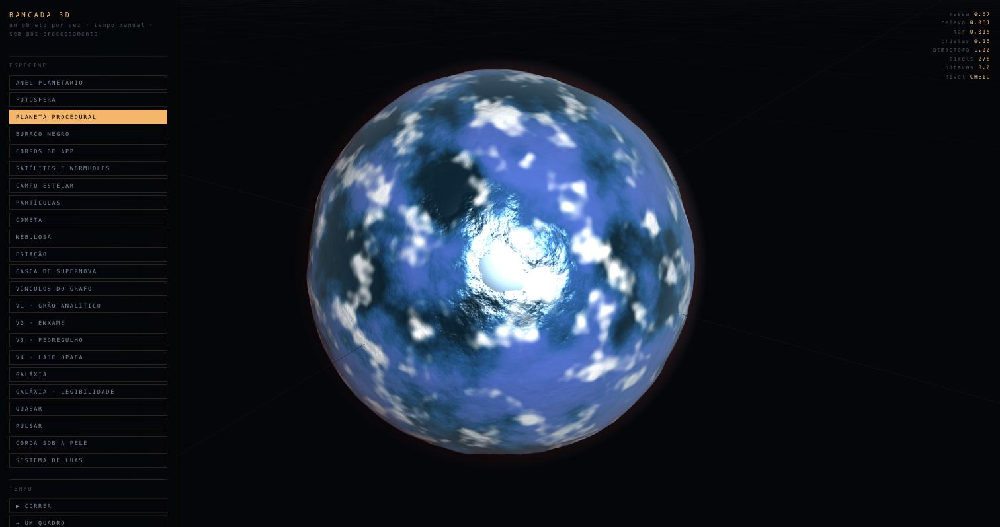
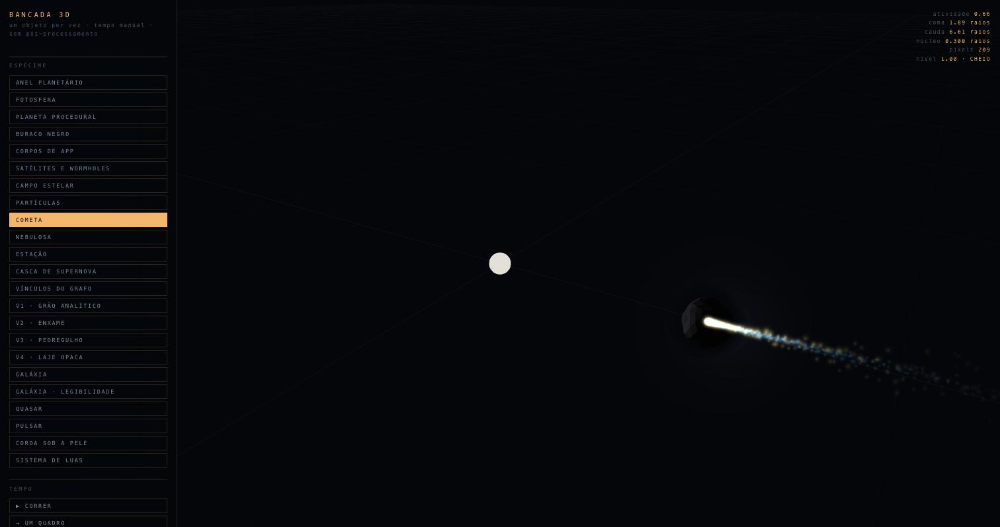
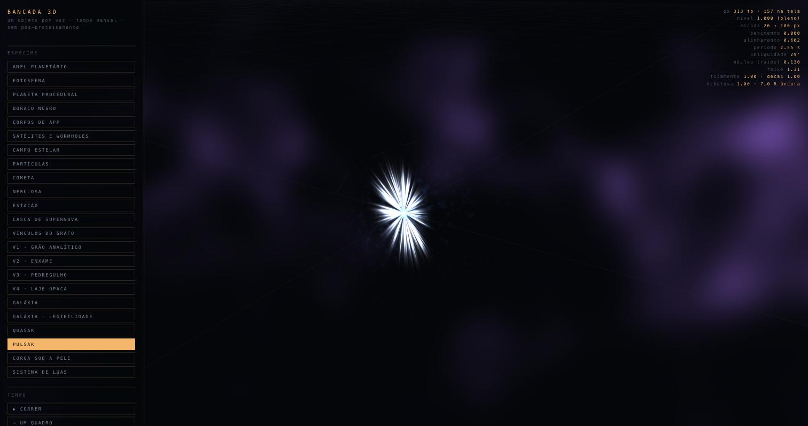
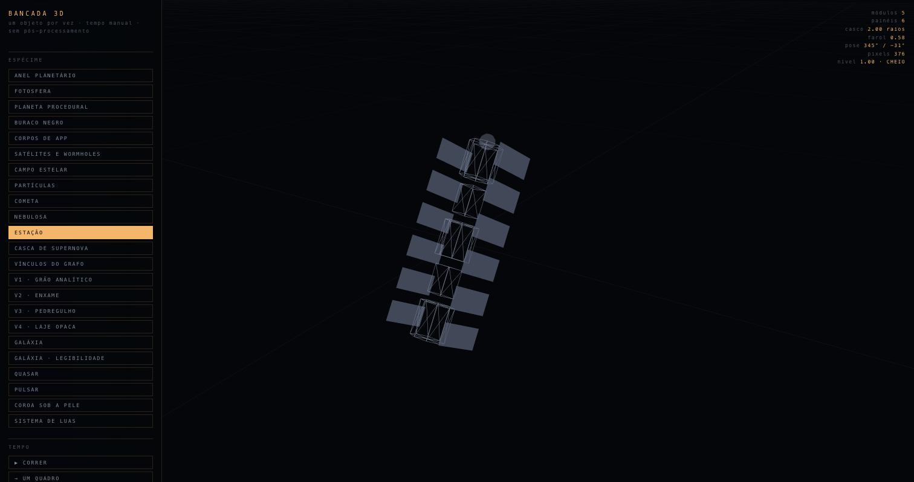
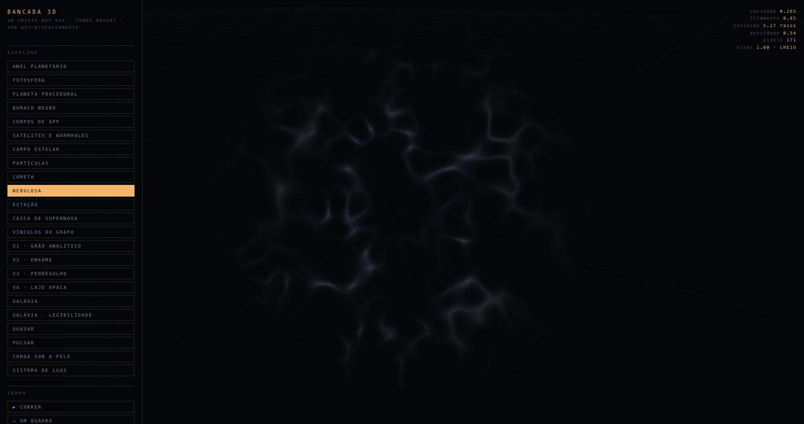
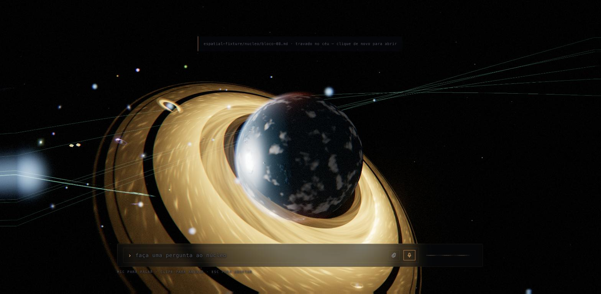
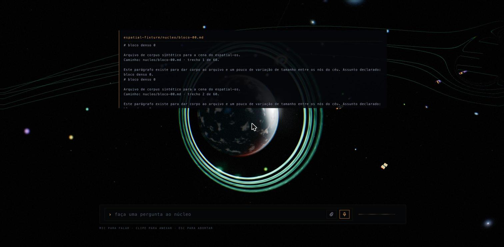
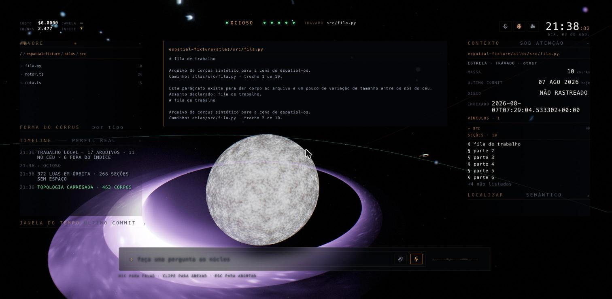

# SpatIA

**The Spatial Operating System for AI.**

> **Knowledge has gravity.**
>
> Information shouldn't live in folders, tabs or endless chats.
>
> It should exist as a living universe.
>
> Every memory has a place.
>
> Every idea has an orbit.
>
> Every connection has gravity.
>
> SpatIA transforms AI into something you can explore, understand and control.

---

Um observatório espacial para um cérebro artificial. O centro é um buraco negro; tudo o que
o agente sabe orbita ele, e tudo o que ele faz é visível como física.

Não é um dashboard com tema escuro. A diferença é de intenção: aqui **não existe animação
decorativa**. Cada movimento na tela corresponde a um evento que aconteceu — uma estrela que
acende é um arquivo que foi recuperado, um wormhole verde é um `Read` que o agente executou,
a timeline é o profile real da execução em milissegundos.

Projeto pessoal, independente. Não faz parte de nenhuma plataforma, não é serviço de
ninguém, e a única coisa que ele assume do mundo externo é que Qdrant responde em
`localhost:6333`. Todo o resto — voz, busca web, integrações — é opcional e se anuncia
apagado quando não está lá.

## Rodar

```bash
cp .env.example .env            # nada é obrigatório; os defaults casam com a infra local
make hooks                      # UMA vez por clone — ver abaixo
make serve                      # http://127.0.0.1:8787
```

É isso. Sem `npm install`, sem build, sem bundler — o `three.js` está vendorizado em
`vendor/` e resolvido por importmap. A única dependência Python é o `fastembed`, declarada
inline no `serve.py` (PEP 723) e resolvida pelo `uv` na primeira execução.

⚠️ **`make hooks` não é opcional, e pular esse passo não dá sintoma.** Ele aponta o git para
`.githooks/`, que é versionado; `.git/hooks/` não é, então um clone sem esse comando nasce **sem o
portão** e commita sem que nada confira. `make` sozinho lista tudo o que dá para rodar:

| | |
|---|---|
| `make leis` | ☠️ o portão — todos os guardas em ~4 s, sai 1 se qualquer um cair. Já roda no `pre-commit` |
| `make leis-lista` | quem roda, e quem NÃO roda com o motivo MEDIDO |
| `make rematerializar` | a cadeia inteira das dimensões do grafo, na ordem que a medida exige |
| `make censos` | o que o céu DESENHA e o que o corpus É |
| `make fixture` | cria e indexa o corpus sintético que exercita todos os tipos |

⭑ **O tooling não tem lista mantida à mão.** Guarda novo entra no portão sozinho; script que
materializa e não tem alvo no `Makefile` **reprova** (`scripts/lei-tooling.mjs`), e a ordem das
receitas é derivada do fonte — quem lê um `.cache/X.json` depende de quem o escreve.

### O mínimo para o sistema fazer sentido

| | Para quê | Sem ele |
|---|---|---|
| `uv` | resolve a única dependência Python | não sobe |
| CLI `claude` no PATH | é o cérebro: ferramentas reais, custo real | nenhuma pergunta é respondida |
| Qdrant com uma coleção indexada | é o corpus: o céu inteiro sai dele | o céu abre vazio |
| `jq` e `curl` | só se você ativar o portão de capacidades | o portão fica inerte **em silêncio** |

O SpatIA **não indexa**. Ele lê uma coleção que outro pipeline escreveu — ver
[Integrar](#integrar). Por isso não existe botão REINDEXAR em lugar nenhum: existe o comando
exibido, e a data em que o índice mudou.

A tela de boot mostra o estado **real** de cada subsistema antes de deixar entrar. Se algo
estiver degradado, ela diz o quê — e o observatório abre em modo parcial em vez de fingir.

Depois de entrar, os pontos de subsistema no alto da tela continuam sendo aferidos, e **ao lado
deles fica a idade da última aferição**. É a diferença entre *"MEMORY está online"* e *"MEMORY
estava online quando eu olhei"* — se o servidor parar de responder, os pontos perdem o brilho e a
idade fica vermelha em vez de o verde continuar afirmando um serviço que caiu. Nada é apagado: o
que foi medido continua na tela, com o de quando ao lado.

### Ambientes

Não há build de produção, e isso é decisão: o sistema é um processo local, com bind em
loopback e sem autenticação. O que muda entre uma máquina e outra é o `.env`.

| Ambiente | Como | O que muda |
|---|---|---|
| **local** (o único suportado) | `./serve.py` | bind `127.0.0.1:8787` |
| **corpus de teste** | `.env` com outra `QDRANT_COLLECTION` e `CORPUS_PREFIX=` | exercita morfologias que o corpus real não tem |
| **atrás de túnel** | `ngrok`/`cloudflared` apontando para a porta | ⚠️ **muda a categoria de segurança** — veja abaixo |

⚠️ **Com túnel, o bind em loopback deixa de ser a proteção que era.** Não há autenticação
de operador, e passa a haver endereço público. A tela `#/security` detecta o cenário
(`X-Forwarded-For`, `Host` diferente de localhost) e diz isso em letra grande — é o único
momento em que a postura de segurança deste sistema muda de categoria.

## O que é real e o que não é

Vale a pena ser explícito, porque uma interface bonita facilmente parece mais capaz do que é.

| Real | Como |
|---|---|
| Os nós do céu | os arquivos agregados da coleção vetorial, com peso = nº de chunks (medido em 2026-08-07: 1.634 arquivos, 1.862 nós, 20.303 chunks) |
| As luas | as seções de um arquivo, quando a massa dele as segura — 279 luas em 40 corpos, pela janela Roche→Hill (`src/space/orbital-zones.js`) |
| A posição de cada nó | **raio = recência** (posto da data do último commit: recente junto ao núcleo, antigo à deriva); ângulo, inclinação e fase saem de hash determinístico do id. O mesmo conhecimento cai sempre no mesmo lugar — **nada a move**, e um oráculo prova isso perturbando o grafo |
| O brilho de um corpo | quantos se parecem com ele (`centrality`) e quantas execuções o abriram (`usage`, com peso metade e só quando a evidência passa do piso). Sem o Neo4j materializado ele cai para a atividade sozinha, nunca para zero — apagar um corpo afirmaria periferia sobre um fato que ninguém mediu |
| A recuperação | busca híbrida densa+BM25 fundida por RRF, ~8ms |
| As chamadas de ferramenta | `tool_use` reais do agente, com argumentos e duração medida |
| As citações `[n]` | apontam para o arquivo que entrou no prompt; citação sem fonte aparece riscada. Clicar numa rola a lista de fontes até a linha dela |
| A lista de fontes | tem TETO de **vista**, nunca de conteúdo: as fontes cabem todas no DOM e a lista rola, com o **total real publicado no topo** — sete linhas à vista não podem ler como "isto é tudo" |
| A lista de fontes, de novo | ela **não repete o que você já está vendo**: a fonte que MEMÓRIA RECUPERADA ou SATÉLITES DE BUSCA já mostra sai da lista e vira uma linha que aponta para o painel, com todos os `[n]` dela dentro. Recolha o painel, mude de tela, ou deixe o painel podar o resultado — a linha volta inteira, porque ali ela é a única testemunha |
| Custo, turnos, tokens, janela de uso | vêm do stream do CLI, não de estimativa |
| A timeline | horário e `ms` medidos por estágio |
| Os avisos de pé, no topo da timeline | o servidor observa índice, corpus, topologia, Neo4j e credenciais e avisa por TRANSIÇÃO — nunca por relógio. Cada aviso diz o que fazer, e quanto tempo faz que está de pé |
| A forma de onda | amplitude medida por `AnalyserNode` — do microfone gravando, ou do MP3 que o TTS devolveu |

| Aproximação | Por quê |
|---|---|
| Lente gravitacional | deflexão analítica ∝ 1/d² em screen-space. Geodésicas por pixel custariam a cena inteira |
| Arestas do grafo | hierarquia real `repo → diretório → arquivo`. O Neo4j é a fonte natural das relações, mas pode estar desligado |
| Depth of field | não existe. Exigiria depth buffer e passe próprio; o desfoque de borda dá a sensação de lente |
| Onda no fallback de voz | quando o TTS do servidor está fora, a fala cai no `speechSynthesis` do browser, que não expõe o buffer — aí a onda volta a ser envelope estimado, e a HUD diz qual motor está em uso |

## Como ler o céu

Nada aqui é decoração. **Cada feição visual é um fato do corpus**, e a regra que governa a leitura
é uma só: a **forma** diz o que o arquivo É, o que está **em volta** dele diz o que está
ACONTECENDO com ele.

As fotos abaixo saíram da bancada (`/canvas.html`), que desenha um objeto por vez, com o tempo
parado e sem pós-processamento — é lá que dá para conferir cada um isolado.

### Os corpos — o que o arquivo É

☠️ **A forma NÃO vem da extensão do arquivo.** Ela vem do PAPEL que o arquivo tem no sistema onde
mora: quem domina, quanto pesa, e o que anda acontecendo com ele. A extensão governa a COR, e mais
nada — um `.yaml` de duas linhas e um `.md` de duzentas não podem desenhar o mesmo objeto só porque
o formato deles é declarado.

| | corpo | você está vendo | quando ele aparece |
|---|---|---|---|
|  | **fotosfera** | granulação fervendo, manchas escuras, borda escurecida | o arquivo é a **entidade dominante** do sistema dele — o mais massivo da pasta, o que dá nome ao lugar |
|  | **planeta** | crosta com relevo, oceano, nuvem e atmosfera no limbo | um corpo sólido do sistema, planeta ou lua — o relevo é a variação interna dele |
|  | **cometa** | núcleo escuro, coma brilhante e cauda longa | a atividade recente **domina** o corpo (não apenas existe) — coma e cauda existem só perto do Sol, e somem quando ele se afasta |
|  | **pulsar** | feixe estreito girando, período regular | o cadáver de uma estrela **gigante** — quem decide é MASSA, não ritmo de edição |
|  | **estação** | módulos enfileirados e painéis solares | ⚠️ **fora do céu, e por decisão**: ela representa um AGENTE, que não é corpo do corpus. Vive na bancada |
|  | **nebulosa** | nuvem filamentar, **sem corpo central** | ⚠️ **fora do céu**: o berço exige uma contenção que o corpus não tem. A metade CADÁVER dela já é desenhada, como casca de supernova |

⭑ **Asteroide fica sem pele de propósito** — o catálogo o define como corpo pequeno e IRREGULAR, e
nenhuma das peles desenha irregularidade. Uma esfera com crosta afirmaria um mundo onde há uma
pedra. Ele volta a ter pele quando entra em atividade extrema, e aí ele é um cometa: os dois são o
mesmo corpo em estados diferentes.

⚠️ **A distribuição do dia sai de `make censos`, nunca deste parágrafo.** Toda pele roteada tem
população — se alguma nascer vazia, o portão reprova.

Falta desta lista, e é dívida assumida: **galáxia** (agregado — pasta ou repo, com braços quando há
grupo a afirmar), **buraco negro** (o núcleo cognitivo, no centro), **casca de supernova** e
**sistema de luas**. Os quatro existem na bancada; não estão fotografados aqui.

### O que está em volta — o que está ACONTECENDO

Estes se somam ao corpo, e vários podem ser verdade ao mesmo tempo.

**Anel = estado do git.** É o único sinal *perecível* do céu: aparece com o trabalho aberto e some
no commit. As três famílias não são estilo, são três estados diferentes:

| | anel | estado | como distinguir |
|---|---|---|---|
|  | **saturno** | `modificado` | dourado, cerrado, com divisão e a sombra do corpo atravessando |
|  | **urano** | `preparado` (staged) | anéis finos e brilhantes, muito mais apertados |
|  | **júpiter** | `não rastreado` | largo e difuso, espalhado bem para fora do corpo |

Corpo que não aceita anel (cometa, nebulosa) recebe um **disco de detritos** pelo mesmo fato — e a
recusa é nomeada, não silenciosa: *"cauda e anel juntos não descrevem nada"*.

| em volta | significa | o fato exato |
|---|---|---|
| **envoltório filamentar**, grande e irregular | supernova: *está sendo martelado agora* | ≥ 5 toques na janela recente |
| **borda fina azul-branca**, colada na silhueta | anã branca: *pesado e parado há muito* | ≥ 13 chunks · sem toque na janela · não dormente · no quarto mais antigo do céu |
| **luas em órbita** | as seções do arquivo, quando a massa as segura | janela Roche→Hill; as que não cabem são reportadas, não somem |
| **coroa acesa** que pulsa e passa | este nó foi **recuperado pela sua pergunta** | evento da busca — some quando ela termina |

⚠️ **A anã branca não julga.** Massa parada tanto pode ser a peça madura que ninguém precisa tocar
quanto o débito que ninguém quer tocar. Ela diz o fato; quem conhece o arquivo tira a conclusão.

### ⚠️ Uma colisão conhecida, e ela é nossa

**Três feições diferentes leem como "um aro em volta do corpo"**: o anel do git, a borda da anã
branca e a coroa da busca. Elas dizem coisas sem nenhuma relação — *trabalho aberto*, *massa
parada*, *foi recuperado agora* — e à distância de céu um usuário não as distingue com segurança.

Isso viola o princípio de que a física comunica significado, e está registrado aqui em vez de
escondido: quem for mexer na borda da anã branca (`src/space/graph.js`, `vDwarf`) está mexendo no
lado errado da colisão se só ajustar o brilho. O conserto é dar a ela um vocabulário próprio —
espessura, continuidade ou posição — que não seja "aro".

## Comandos

| | |
|---|---|
| digitar + `Enter` | pergunta ao núcleo |
| segurar `Espaço` | falar (STT do browser) |
| botão `VOZ` | lê a resposta em voz alta pelo TTS do oracle, frase por frase |
| `Esc` | aborta o ciclo |
| `Tab` | modo cinematográfico — a HUD desaparece, sobra o núcleo e o texto |
| `` ` `` (ou botão AFINAR) | painel de afinação visual (33 parâmetros, persistidos neste navegador). O grupo GLOBAL é o que atravessa a cena toda: velocidade, volume, brilho, contraste e saturação |
| `P` | vai para `#/security` — permissões, alcance e exposição |
| `1`–`9` | vai ao app daquela tecla (a tecla é declarada no manifesto, não é a posição) |
| `Home` | volta à raiz |
| `Alt+R` | devolve a câmera à deriva automática |
| `⌘M` | mudo |
| arrastar / roda | orbitar / aproximar |
| clicar num nó | trava a câmera nele **e** abre o conteúdo indexado, ancorado no astro |

## As telas

Cada app é um **destino**, com endereço próprio. O endereço carrega o que a tela está
mostrando — `#/files/docs/EVENTS.md` e `#/journal/r-2026-08-07-001` sobrevivem ao F5 e viajam
num link. Um OS onde F5 te devolve à tela inicial não é ambiente, é demo.

| Tecla | Rota | A pergunta que ela responde |
|---|---|---|
| `1` | `#/files` | o que o núcleo sabe sobre X? |
| `2` | `#/system` | que instalação é essa, e o que ela roda agora? |
| `3` | `#/web` | o que o mundo externo respondeu, e por qual provedor? |
| `4` | `#/bridge` | que porta externa está aberta, com qual credencial? |
| `5` | `#/journal` | o que aconteceu enquanto eu não olhava — e prove |
| `6` | `#/metrics` | demorou onde? custou quanto? a tela aguenta? |
| `7` | `#/security` | o que este agente alcança agora, e com que prova? |
| `8` | `#/activity` | o que executa neste instante, e como eu paro? |
| `9` | `#/storage` | o corpus é confiável? |

Alguns painéis são **residentes**: o compositor, a timeline, o contexto do céu e a janela do
tempo entram em **todas** as dez rotas, e o sistema recusa registrar uma tela que deixe qualquer
um deles de fora. Dá para perguntar de qualquer rota, e a resposta aparece em qualquer rota.
Abrir uma seção recolhe as outras **do mesmo trilho** — e só dele, porque abrir algo à direita
não pode fechar o que se está lendo à esquerda.

A ordem de construção e o que cada tela deliberadamente NÃO mostra estão em
[`docs/OS-SCREENS.md`](docs/OS-SCREENS.md).

### Quanto da janela a interface está tomando — `spatia.hud()`

A HUD flutua sobre o céu, e a pergunta que ninguém conseguia responder era *quanto dele ela tira
do mouse*. `spatia.hud()`, no console, responde com número em vez de impressão:

    spatia.hud().ponteiro     // reivindicado × chegando ao canvas, atribuído por dono e por fenda
    spatia.hud().widgets      // recolhido · fora do manifesto · declarado e AUSENTE · ESPREMIDO
    spatia.hud().fendas       // o orçamento de altura de cada fenda: piso, pedido e pressão

☠️ **A grandeza é área que ACEITA PONTEIRO, não área desenhada.** Os gestos da cena estão presos
ao `canvas`: um painel por cima não disputa o clique, ele **cancela** órbita e zoom naquele
retângulo. A sonda varre a janela em grade com `document.elementFromPoint` e devolve o passo e a
contagem de pontos junto — qualquer fração dela se refaz à mão. Ela também separa as **quatro**
causas de *"esse painel sumiu"*: **o operador recolheu**, **esta rota não pede o painel**, **a rota
pediu e ele não montou**, ou **ele foi ESPREMIDO** — aberto, no DOM, e desenhando menos que uma
linha do próprio texto. As duas últimas são defeito; as duas primeiras são decisão.

⭑ **Cada fenda publica o próprio orçamento de altura**, e é ele que responde *"quantos cabem
aqui"* — uma pergunta que o layout resolvia sozinho, sem nunca enunciar. `cabe: false` avisa
**antes** de alguém sumir; `pressao > 1` é só conteúdo longo rolando, e não é defeito.

⚠️ Ela lê a rota que está na tela e **carimba qual é**. Para comparar as dez, navegue e colecione.

### A câmera volta a responder por cima do painel

*"Não consigo dar zoom nem controlar a câmera quando o astro está em foco — se eu afastar o mouse
para as laterais, funciona."* O painel de palco (o leitor de arquivo, a página de configuração, a
tabela de execuções) tem uma **moldura** que estica pela coluna central inteira e **não desenha
nada**; o que se vê é o corpo dela, que para na altura do conteúdo. A moldura transparente é que
estava tirando o mouse do céu, bem em cima do corpo em foco.

> **Agora quem PINTA reivindica o ponteiro; quem só POSICIONA cede.**

Órbita, zoom e clique de seleção voltam a funcionar em toda a faixa onde não há painel desenhado —
e continuam indo para o painel onde há texto para rolar, selecionar e clicar. Nada mudou de lugar:
o painel ocupa o mesmo espaço, com o mesmo conteúdo. `scripts/lei-palco.mjs` impede a volta, e
varre o CSS inteiro atrás de qualquer superfície nova que tome o mouse sem desenhar nada.

### O documento pertence ao astro, e a tela mostra isso

O conteúdo do arquivo travado abria como um retângulo no meio da tela, sem relação nenhuma com o
corpo — dava para ler sem nunca saber se aquilo era do planeta, do sistema ou da cena.

> **Agora ele nasce colado no limbo do astro e anda com a câmera.**

Orbite: o texto acompanha o corpo. Leve o corpo para trás do horizonte de eventos: o texto some
junto, porque ele é do corpo. Destrave, e ele volta ao lugar de sempre.

**E o astro o ILUMINA.** O fundo do documento deixou de ser um retângulo chapado: ele é quente do
lado que encosta no corpo, esfria até o vazio do lado oposto, e a aresta acesa troca de lado junto
com o painel. Astro grande na tela alcança mais longe sobre a superfície; um ponto de 4 px quase não
a toca.

Enquanto o painel acompanha o corpo, a luz fica parada sobre ele — o painel e o astro andam juntos.
Quando o corpo empurra o painel contra a borda da tela e continua, a luz **desliza** sobre a
superfície: é aí que a profundidade tem o que mostrar, e é o mesmo mecanismo, não um segundo.

**E o endereço leva as duas coisas junto.** `#/files/<caminho>` abre o documento **e** trava a
câmera no astro dele — num link compartilhado, numa aba restaurada, num F5. Antes o endereço abria
só o texto e a câmera voltava para onde você tinha parado da última vez, que costumava ser outro
corpo: você lia o arquivo com o céu olhando para outra coisa.

⭑ **Sem endereço nada mudou** — abrir na raiz continua devolvendo você ao astro da sessão anterior,
com o zoom que você gravou. Endereço PEDIDO e último visitado são fatos diferentes, e o pedido só
tem precedência quando existe.

⚠️ **Ele nunca sai da janela, e nunca cobre os trilhos.** Quando o astro chega perto da borda o
painel encosta e para — a direção continua legível, o texto continua inteiro, e os painéis laterais
continuam clicáveis. A faixa em que ele anda é o **palco**, não a janela: onde os trilhos somem
(janela estreita), ela volta a ser a janela inteira sozinha. Onde ele está e **por que** está lá sai
em `spatia.ancora()`, com as quatro causas separadas por nome: sem corpo travado, painel não
montado, corpo atrás da câmera, corpo eclipsado.

⭑ **A área que ele tira do céu é a mesma de antes** — a caixa que já pintava mudou de lugar, não de
tamanho: 533 pontos ao ponteiro com e sem a âncora. Seguir a câmera custa **0,9 µs por quadro**, e o
gradiente **não repinta**: zero repinturas em 601 quadros parado e em 480 quadros de zoom.
`scripts/lei-ancora.mjs` guarda as três coisas.

### Você dá cara aos arquivos que importam — e o céu obedece

Um céu deduzido inteiro é justo e é anônimo: nenhum dos 1 636 corpos é *o seu*. Marque um com **`F`**
e ele passa a ter dono; escolha uma aparência na seção **FAVORITO** do painel de contexto e ele passa
a ter cara.

> **A escolha vence a dedução, e é a única coisa na tela que faz isso.**

Um arquivo que o sistema desenharia como rocha cinza vira **Marte**; um que ele desenharia como
planeta genérico vira **Saturno**, com as bandas da textura real — e o anel de git por cima, que é
fato do corpus e continua sendo dito. Trave o corpo, troque a aparência: **a troca é no mesmo
quadro**, sem sair e voltar.

⚠️ **Marca não é medida, e a tela diz isso com essas palavras.** Ela não muda o que o corpo É — nem
classe, nem física, nem tamanho, nem lugar. Ela mora em você (`prefs`), não no corpus: dois
operadores veem marcas diferentes sobre a mesma topologia, e é exatamente isso que a torna marca.

⭑ **O que cada corpo aceita sai do que ele É.** Rocha, cometa e planeta recebem as peles sólidas;
estrela, supernova e núcleo de quasar recebem as gasosas. Corpo sem contexto de aparência **diz por
quê** em vez de oferecer uma lista vazia.

⚠️ **No cometa a marca veste o NÚCLEO.** Coma e cauda são gás que o corpo perdeu — pintá-las com uma
foto de superfície seria falso.

⭑ **E o BRILHO cede quando você chega perto de um corpo sólido.** Planeta, rocha, núcleo de cometa e
estação não emitem luz: o florescimento que os envolve some gradualmente conforme a superfície
aparece, para você poder ver o corpo em vez de um estouro branco. Em quem É emissão — estrela,
pulsar, nebulosa — nada cede, porque ali o brilho é o próprio corpo.

⚠️ **Marca cuja classe mudou não some — ela ANUNCIA.** *"Não marquei"* e *"marquei e não vale mais
aqui"* são fatos diferentes, e a escolha fica guardada esperando o corpo voltar.

### E a lista devolve você a eles

Marcar sem lista deixa a segunda pergunta sem resposta: *"quais eu marquei?"* e *"como volto lá?"*.
A seção **MARCADOS**, no trilho da esquerda ao lado da ÁRVORE, responde as duas — cada linha traz o
corpo e a cara que você deu a ele, e **um clique leva de volta**: a câmera trava no astro e o
documento abre, como se você tivesse achado o arquivo na árvore.

A ordem é por **quando você marcou**, não alfabética — a pergunta é *"o que eu estava
acompanhando"*, e ordenar por caminho é o que a árvore ao lado já faz melhor.

☠️ **Corpo que sumiu do céu não vira botão morto.** Se o arquivo saiu do corpus entre duas sessões, a
marca continua na lista e diz isso — mas não é clicável, porque não há astro para onde ir. Um botão
que parece funcionar e não faz nada é pior que a ausência dele.

A régua é `spatia.favoritos()`, e o que a rocha em foco está de fato vestindo sai em
`spatia.planet().morfologica` — `escolha` (o arquivo declarado) ao lado de `textura` (o que a pele
pegou).

## Arquitetura

Quatro camadas que **não se conhecem**. Todas assinam o mesmo barramento de eventos.

```
                  ┌─────────────────┐
   pergunta ─────▶│  agent.py       │  ciclo cognitivo
                  │  ↳ qdrant       │  (recuperar → buscar → sintetizar)
                  │  ↳ websearch    │
                  │  ↳ brain/claude │
                  └────────┬────────┘
                           │ SSE, um evento por passo
                  ┌────────▼────────┐
                  │  core/bus.js    │
                  └──┬───┬───┬───┬──┘
         ┌───────────┘   │   │   └───────────┐
    ┌────▼────┐   ┌──────▼─┐ ┌▼──────┐  ┌────▼─────┐
    │  space  │   │  hud   │ │ audio │  │ recorder │
    │ (three) │   │ (dom)  │ │(web-  │  │ (métricas│
    │         │   │        │ │ audio)│  │  prom)   │
    └─────────┘   └────────┘ └───────┘  └──────────┘
```

O contrato está em [`docs/EVENTS.md`](docs/EVENTS.md) — leia antes de mexer em qualquer
camada. A propriedade que ele garante: trocar o retriever, o modelo ou o provedor de busca
não muda uma linha de shader.

**As métricas derivam do mesmo stream que desenha a tela.** Isso não é elegância: significa
que não existe divergência possível entre o que se vê e o que se mede. Detalhes e o
catálogo em [`docs/METRICS.md`](docs/METRICS.md), exposto em `/metrics`.

### Arquivos

```
serve.py                 entrypoint (PEP 723 — uv resolve a dependência)
server/
  config.py              defaults + .env
  app.py                 rotas, SSE, /metrics
  agent.py               o ciclo cognitivo  ← o contrato de eventos nasce aqui
  brain.py               claude -p como subprocesso, traduzido para eventos
  llm.py                 ollama (cérebro offline) + montagem do prompt
  qdrant.py              busca híbrida, varredura, vizinhos
  embed.py               fastembed (ONNX na CPU, sem rede)
  graph.py               topologia derivada da coleção
  graphdb.py             Neo4j — a camada de RELAÇÃO, e a única que pode faltar
  recency.py             recência · churn · dormência · regularidade, do git
  services.py            os serviços de um compose: as partes nomeadas de um arquivo
  catalog.py             o catálogo servido
  dirty.py               o que o git status vê e o índice não
  attach.py · speech.py  anexos · voz
  permissions.py · mcp_scopes.py   o portão, e os escopos que ele conhece
  net.py                 o único lugar que abre socket para fora
  websearch.py           brave · serpapi · searxng · fallback ddg
  files.py               leitura com barreira de raiz
  promex.py              Counter/Gauge/Histogram + formato 0.0.4
  metrics.py             o catálogo — o que se mede e por quê
  recorder.py            evento → métrica  ← alimenta diário E registro de vivas
  journal.py             o ledger append-only, encadeado por hash
  running.py             execuções vivas + o cancelamento cooperativo
  budget.py              teto de custo diário e concorrência
  units.py               desejado vs real + grafo de dependência
  storage.py             coleção, vetores esperados vs presentes, caches
  webhooks.py            HMAC obrigatório, política por endpoint
  hookqueue.py           a fila de entregas EM DISCO
  credentials.py         o único lugar que lê um segredo
  oauth.py               PKCE + loopback
  bridge.py              o agente fala com ela, não com o terceiro
  capabilities.py        (verbo, escopo, limite) + o portão PreToolUse
config/
  units.json             o desejado desta instalação
  capabilities.example.json
src/
  kernel/  registry · router · widgets   ← rota, manifesto, montagem
  core/    bus · state · api · tuning · promtext (parser do /metrics)
  apps/    files · system · web · bridge · journal · metrics · security · activity · storage
  space/   scene · graph · universe                  ← as duas cenas e o layout
           entity-physics · superficies · sistemas · astrofisica
                                                     ← a ONTOLOGIA: quem decide o que um corpo É.
                                                       PUROS — sem three, sem DOM, sem cena
           catalog · solver                          ← só os MODIFICADORES (anel, detritos,
                                                       envoltório); a pele não sai daqui
           photosphere · planet · comet · pulsar · nebula · station · quasar
                                                     ← as PELES (uma por classe, roteadas pela ontologia)
           blackhole · lensing · stars · particles · satellites · galaxy · backdrop
           rings · moon-orbits · orbital-zones · links · lod · motion-catalog
           foco-de-entrada · ancora-de-documento     ← que corpo olhar, e onde o documento dele mora
  hud/     frame · streams · answer · terminal · controls · boot · dom
  audio/   engine (síntese procedural, zero asset)
vendor/    three.js + postprocessing
```

## Configurar

A configuração mora em **três lugares, com donos diferentes**, e a divisão não é arbitrária:

| Onde | O que | Por quê ali |
|---|---|---|
| `.env` | endereços, chaves, tetos — o que é da MÁQUINA | muda por instalação, não por uso |
| `.cache/config.json` | permissões, skills, agentes | é editado na UI e tem de sobreviver ao reload |
| `config/*.json` e `AGENT_CWD/.claude/spatia/` | unidades e capacidades declaradas | é política, e política se lê num arquivo versionável |

### `.env` — o que é da máquina

```ini
# ---------- cérebro ----------
BRAIN=claude                 # ou `ollama`: responde offline e de graça, sem ferramenta nenhuma
AGENT_CWD=                   # onde o agente enxerga arquivos. Vazio = só este projeto
AGENT_MODEL=                 # vazio = default do CLI
AGENT_MAX_TURNS=10
AGENT_MCP_CONFIG=            # caminho de um --mcp-config; entra com --strict-mcp-config

# ---------- teto de custo ----------
AGENT_MAX_DAILY_USD=0        # 0 = SEM TETO. Acima dele, /api/ask devolve 429 e não executa
AGENT_MAX_CONCURRENT=0       # 0 = sem limite de execuções simultâneas

# ---------- memória ----------
QDRANT_URL=http://localhost:6333
QDRANT_COLLECTION=workspace_embedding
EMBED_MODEL=sentence-transformers/paraphrase-multilingual-MiniLM-L12-v2
CORPUS_PREFIX=               # segmento-recipiente a podar do `source` (ex.: `vault/`)

# ---------- voz, busca, servidor ----------
TTS_URL=http://localhost:8880
BRAVE_API_KEY=               # satélite apagado até a chave existir
SEARXNG_URL=http://localhost:8888
ESPATIAL_HOST=127.0.0.1
ESPATIAL_PORT=8787
FILE_ROOTS=                  # raízes extras que o inspetor pode ler, separadas por `:`

# ---------- portas de fora (opcional) ----------
WEBHOOK_SECRET_GITHUB=       # SEM segredo o endpoint NÃO SOBE — devolve 401
WEBHOOK_POLICY_GITHUB=draw   # draw (default) · enqueue (retém em disco) · off
OAUTH_GITHUB_CLIENT_ID=
OAUTH_GITHUB_CLIENT_SECRET=
```

⚠️ **O teto de custo é RECUSA, não aviso.** A execução que cruzaria o limite não começa —
avisar depois do gasto seria o relatório de um acidente. E o gasto do dia sai do diário, em
disco: um contador em memória zeraria no restart, e um teto que se apaga sozinho a cada
reinício não é teto.

⚠️ **`ESPATIAL_PORT` deixa de ser detalhe local** no momento em que a primeira integração
OAuth existe: o provedor exige a porta exata registrada.

**A busca web é opt-in.** É o único passo que expõe a pergunta a terceiros. Ou o operador
liga o toggle `WEB`, ou usa uma palavra explícita ("pesquise", "notícia", "hoje").

### `config/units.json` — o desejado, ao lado do real

Sem ele, TTS fora do ar é indistinguível de TTS que nunca foi para ser usado nesta
instalação — e pintar de vermelho uma ausência que é escolha ensina o operador a ignorar
vermelho.

```json
{ "qdrant": { "state": "required",
              "degrades": "sem contexto recuperado; o céu não carrega",
              "start_hint": "cd core/oracle && make up qdrant" },
  "tts":    { "state": "optional",
              "degrades": "a voz cai no speechSynthesis do browser" },
  "ollama": { "state": "disabled", "degrades": "—" } }
```

`required` · `optional` · `disabled`. O default de quem não está no arquivo é `optional`:
assumir obrigatoriedade por omissão transformaria toda instalação enxuta num painel vermelho.

⚠️ **`start_hint` é TEXTO, nunca botão.** O SpatIA não é o init desta máquina — ele não sobe
Qdrant nem Ollama, e um painel que finge poder é a mesma classe de erro do interruptor que
não controla.

### `AGENT_CWD/.claude/spatia/capabilities.json` — capacidade, não lista de nomes

Uma lista de nomes negados não é autoridade: `Read` com a raiz no projeto e `Read` com a raiz
no workspace inteiro são a mesma marca de seleção e duas autoridades separadas por ordens de
magnitude. Copie de `config/capabilities.example.json`:

```json
[ { "id": "fs.read", "verb": "Read|Glob|Grep",
    "scope": ["$AGENT_CWD"], "limit": { "calls_per_run": 40 } },
  { "id": "net.fetch", "verb": "WebFetch|WebSearch",
    "scope": [], "limit": { "calls_per_run": 5 } } ]
```

Enquanto o arquivo não existe **nada é negado e nem hook é instalado** — um portão que
sempre permite seria uma requisição por chamada de ferramenta sem decisão em troca. Com ele,
um hook `PreToolUse` consulta `/api/gate` ANTES de cada chamada, e o que não está nomeado não
passa.

Ele mora no `.claude/` do `AGENT_CWD` porque é lá que as configurações do agente já moram
(skills, agentes, settings) — e porque a política é sobre o que o agente pode fazer NAQUELE
workspace: trocar `AGENT_CWD` troca a política junto.

⚠️ **O portão depende de `jq` e `curl` no PATH.** Sem eles ele fica inerte **em silêncio** —
`#/security` reporta `missing_tools` e o efeito vira "DECLARADO E NÃO APLICADO".

## Integrar

### Qdrant — o corpus

É a única coisa que o sistema assume do mundo externo. O SpatIA **lê** a coleção; quem
escreve é outro pipeline.

⚠️ **A coleção precisa de DOIS vetores nomeados.** Declarar só um derruba a busca inteira —
e derruba em silêncio, devolvendo **resultado vazio em vez de erro**:

| | Nome esperado | De onde vem |
|---|---|---|
| denso | `fast-<último segmento do EMBED_MODEL>` | mesma regra do `FastEmbedProvider` do `mcp-server-qdrant` |
| esparso | `bm25`, com `modifier: idf` | BM25 do lado do Qdrant |

Com `EMBED_MODEL=sentence-transformers/paraphrase-multilingual-MiniLM-L12-v2`, o denso tem
de se chamar `fast-paraphrase-multilingual-minilm-l12-v2`.

**A tela `#/storage` compara o esperado com o presente**, e existe exatamente por causa desse
modo de falha que não levanta exceção nenhuma. Se a busca "não acha nada", é o primeiro lugar
para olhar.

O payload de cada ponto precisa de `source` (o caminho) e o texto do chunk. `section` é
opcional e vira lua no céu.

### Obsidian — o vault como corpus

O SpatIA não lê o vault direto: ele lê o índice do vault. O caminho é

```
~/vault  ──▶  seu indexador  ──▶  coleção Qdrant  ──▶  SpatIA
```

Se o seu indexador publica tudo dentro de um recipiente (`vault/wiki/...`,
`vault/workspace/...`), declare-o:

```ini
CORPUS_PREFIX=vault/
```

Sem isso o primeiro segmento do `source` deixa de ser o nome da raiz, e **quatro lugares
quebram igual e em silêncio**: o leitor de arquivo, a chave de git para recência, a varredura
de sujos e o registro de caminho do cliente. A poda mora na fronteira de entrada
(`qdrant.strip_prefix`) para que todo consumidor receba o formato de sempre.

Para o agente também *escrever* no vault, aponte `AGENT_CWD` para lá e adicione a raiz em
`FILE_ROOTS` — o inspetor só serve o que estiver declarado ali.

### Ollama — cérebro offline

`BRAIN=ollama` responde local e de graça, **sem ferramenta nenhuma**: nada de `Read`, `Bash`
ou MCP. Serve para olhar o corpus sem gastar da assinatura, não para trabalhar.

```ini
BRAIN=ollama
OLLAMA_URL=http://localhost:11434
OLLAMA_MODEL=gpt-oss:20b
```

### TTS — voz do servidor

Kokoro com API compatível com a da OpenAI. Sem ele a fala cai no `speechSynthesis` do
browser, e a HUD **diz** qual motor está em uso. Com `units.json` declarando `tts` como
`disabled`, a mensagem passa a ser "desligado nesta instalação" em vez de "fora do ar" — que
são fatos diferentes.

### Busca web — três provedores, um sem chave

`SEARXNG_URL` é o único que atende sem cota e sem expor a pergunta a um terceiro comercial.
`BRAVE_API_KEY` e `SERPAPI_API_KEY` acendem os satélites correspondentes; sem chave o
satélite aparece **apagado** na cena, não ausente.

### MCP — duas listas que discordam de propósito

Este servidor **não é cliente MCP**. Quem alcança os servidores é o agente, e `#/bridge`
mostra duas listas: o **declarado em arquivo** (por escopo, com o motivo de cada exclusão) e
o **reportado pela sessão**. Elas discordam porque conectores da conta não estão em arquivo
nenhum que este servidor possa ler — fundi-las esconderia justamente a diferença.

### Webhooks — o mundo externo virando eventos

`POST /hooks/<fonte>` com `X-Espatial-Signature: sha256=<hmac>` do corpo cru. Fontes
conhecidas: `github`, `prometheus`, `ci`, `generic`.

```bash
BODY='{"repository":{"full_name":"org/repo"}}'
SIG=$(python3 -c "import hmac,hashlib,sys;print('sha256='+hmac.new(b'$SEGREDO',sys.argv[1].encode(),hashlib.sha256).hexdigest())" "$BODY")
curl -X POST -H "X-Espatial-Signature: $SIG" -d "$BODY" http://127.0.0.1:8787/hooks/github
```

⚠️ **O HMAC é obrigatório, não configurável.** `Sec-Fetch-Site` não protege esta rota — o
remetente é um servidor e não preenche o cabeçalho —, então o HMAC é a única barreira que
existe aqui. Endpoint sem segredo **não sobe**: 401, e a recusa vira linha no diário.

`WEBHOOK_POLICY_<FONTE>=enqueue` retém a entrega numa fila **em disco**, que sobrevive ao
restart. Com `draw` (o default) a cena desenha e nada fica retido.

⚠️ `127.0.0.1` não recebe webhook da internet: ou o remetente é local, ou existe um túnel —
e aí vale o aviso de [Ambientes](#ambientes).

### OAuth e a ponte autenticada

Authorization Code + **PKCE**, com loopback como redirect (RFC 8252). O fluxo inteiro é
servidor-a-servidor: a página recebe só a URL de autorização e não sabe mais nada.

1. `OAUTH_<PROVEDOR>_CLIENT_ID` / `_CLIENT_SECRET` no `.env`
2. registre no provedor **o redirect que `#/bridge` mostra** — o Google exige `localhost`
   literal, o GitHub aceita `127.0.0.1`, e todos exigem a porta exata
3. AUTORIZAR na tela

O segredo vai para `.cache/credentials.json` criado com modo `0600` (`Path.write_text` cria
`0644`, e aqui isso é a diferença entre segredo e arquivo). **Nenhuma rota devolve o valor,
nem mascarado** — só a impressão `sha256:…`, que serve para dizer "é a mesma de ontem".

E o agente nunca vê o token:

```
agente  ──WebFetch──▶  /api/bridge/github/user  ──Authorization──▶  api.github.com
```

A regra completa é **o agente fala com a ponte, não com o terceiro** — extensão do princípio
que o projeto já tinha (*o browser fala com `/api/tts`, não com o TTS*). O caminho é
prefixado e nunca livre: sem isso a ponte seria um SSRF autenticado com a credencial do
operador.

### Prometheus — se você quiser histórico

`/metrics` no formato 0.0.4, 21 famílias. A tela `#/metrics` lê esse mesmo endpoint direto,
sem serviço nenhum no meio — **o processo é o armazenamento**, contadores em memória desde o
boot, sem série temporal. Quem quer histórico aponta um Prometheus para `/metrics`; a tela
diz isso em vez de inventar um eixo do tempo sobre dados que não existem.

## Voz

O botão `VOZ` lê a resposta em voz alta. Duas decisões que valem explicação:

**Fala por frase, não pela resposta inteira.** Esperar o `answer` completo significa esperar o
modelo terminar E o motor sintetizar tudo. Medido nesta máquina: a voz começa em **~10s** (a
primeira frase fechada) contra ~40s se esperasse o fim. Cada frase fechada durante o stream de
tokens entra numa fila serial — paralelo chegaria antes e falaria fora de ordem, e resposta
técnica lida na ordem errada é pior que lida devagar.

**O browser fala com `/api/tts`, não com o TTS.** Mesma origem (sem CORS), o cliente não
conhece a infra, e voz/modelo são config de servidor (`TTS_VOICE`, `TTS_MODEL`) — quem abre a
página não escolhe. `/api/health` reporta se o motor está no ar **e** se a voz configurada
existe nele: voz inexistente falha em toda síntese e devolveria 200 no health sem isso.

Markdown é removido antes de sintetizar (`` `código` ``, `**negrito**`, `[3]`) — no ponto por
onde todos os caminhos passam, senão o motor lê a crase.

Requer o TTS global do oracle: `make up nvidia speech` (ou `cpu`). Sem ele, cai no
`speechSynthesis` do browser e a HUD diz que caiu.

## Permissões (tela `#/security`, tecla `P`)

Permissões, skills e agentes **não** vivem no `.env`: vivem num estado editável na UI
(`.cache/config.json`) que o `brain.py` traduz para flags do CLI a cada execução.

A tecla `P` navega em vez de sobrepor, e o motivo é o critério de painel-ou-destino: nenhum
toggle de permissão tem efeito na execução em curso — ele vira flag da PRÓXIMA invocação.
Não há nada acontecendo para olhar junto, e portanto nenhum custo em ser tela. Os controles
continuam no painel, que a tela abre pelo mesmo gatilho: dois lugares desenhando o mesmo
switch divergiriam na primeira alteração.

⚠️ **A lista de ferramentas cobre menos do que parece.** Nesta instalação são 178 ferramentas
na sessão contra 11 na lista de toggles — com `AGENT_ALLOWED_TOOLS` vazio não sai
`--allowedTools` nenhum e o conjunto real é tudo o que o CLI tem; os toggles só sabem NEGAR.
O widget ALCANCE mostra os dois números lado a lado, porque a diferença entre eles é
exatamente o que nenhum toggle controla.

A regra que o painel respeita: **todo toggle vira flag real**. Interruptor que não muda o
comando executado é pior que interruptor nenhum, porque o operador passa a confiar num
controle que não controla. O painel mostra o comando resultante no pé, como prova.

| Toggle | Vira |
|---|---|
| ferramenta desligada | `--disallowedTools Nome` |
| modo de permissão | `--permission-mode <modo>` |
| fonte de settings ligada | `--setting-sources project,local,user` |
| skill desligada | `--disallowedTools "Skill(nome)"` |
| agente desligado | `--disallowedTools "Task(nome)"` |
| todas as skills desligadas | `--disable-slash-commands` |

O catálogo é **descoberto** em `.claude/agents/*.md` e `.claude/skills/*/SKILL.md` do
`AGENT_CWD`, lendo o frontmatter. Skill nova no repo aparece no painel sozinha.

⚠️ Um acoplamento que não dá para esconder: skills e agentes do projeto só existem para a
sessão se as settings do projeto forem carregadas — e isso traz os **hooks do projeto** junto.
Não há flag que separe as duas coisas, e o painel diz isso em vez de fingir que separa.

### As três fontes de settings, com o custo medido

Um toggle só ("carregar `.claude` do repo") escondia que existem três fontes, e isso produziu um
bug: `hub-board` e `graphiti` vivem no escopo **`local`** (`~/.claude.json` →
`projects[<cwd>].mcpServers`, onde `claude mcp add` grava por default), que
`--setting-sources project` não alcança. O painel de MCP não os listava e não dizia por quê.

Medido em 2026-08-04 (`claude -p` com `claude-haiku-4-5`, `cache_creation_input_tokens` do frame
`result`):

| `--setting-sources` | cache criado | ferramentas | servidores MCP |
|---|---|---|---|
| (vazio) | 2.703 tk | 29 | 0 |
| `project` | 15.573 tk | 41 | 5 |
| `project,local` | 16.423 tk | 104 | 7 |
| `project,local,user` | 25.489 tk | 159 | 8 |

O escopo que faltava custa **~850 tokens**, não os ~9.100 do `user` — o medo de "trazer as
regras globais de volta" era do escopo errado. Por isso `project,local` é o default e `user` é um
toggle explícito com o custo escrito na própria linha.

O painel `br-mcp` mostra **duas** listas: o **declarado em arquivo** (por escopo, com o motivo de
cada exclusão) e o **reportado pela sessão**. As duas discordam de propósito — conectores da
conta (`claude.ai …`) não estão em arquivo nenhum que este servidor possa ler, e fingir que a
primeira lista explica a segunda seria voltar a omitir.

### A barreira que o modo assistente exige

Com ferramentas totais (`bypassPermissions`, `Bash` ligado), `GET /api/ask?q=…` executa
comandos arbitrários. Qualquer página aberta no browser pode disparar essa URL por
`fetch`/``/`<form>`: o CORS bloqueia a *leitura* da resposta, mas a requisição executa —
e para rodar um comando isso basta. É CSRF virando execução remota no próprio localhost.

Por isso `/api/ask` e `POST /api/config` recusam requisição `cross-site`, lendo o
`Sec-Fetch-Site` que o browser preenche e a página não falsifica. Cliente sem o cabeçalho
(`curl`) passa: a ameaça é a página web, não o terminal de quem já está na máquina.

Isso **não** substitui o bind em `127.0.0.1`, e não protege de nada rodando localmente.

## Estender

**Um comportamento novo na cena** = um evento novo no `agent.py` + quem reage no `space/` ou
no `hud/`. O `recorder.py` é o único lugar que precisa saber contá-lo.

**Um parâmetro visual novo** = uma linha no `SPEC` do `core/tuning.js` + o módulo que o
consome. O painel se constrói sozinho a partir da tabela. Se ele vale para a cena inteira, entra
no grupo `GLOBAL` e o consumidor é um só: o relógio dos objetos (`space/scene.js`) ou o passe de
gradação (`space/lensing.js`).

**Um objeto 3D novo** = o módulo em `space/` + um espécime na bancada (`canvas.html`). O espécime
declara os próprios controles e o que OLHAR; a bancada os desenha sozinha. É a REGRA DA INSPEÇÃO:
camada sem controle é camada que ninguém confere.

**Um script novo em `scripts/`** = o arquivo, e nada mais **se ele for um guarda**: o portão varre o
diretório e o descobre sozinho. **Se ele materializar** — escrever em `.cache/` ou no grafo — ele
precisa de um alvo no `Makefile`, e `scripts/lei-tooling.mjs` reprova enquanto não tiver: um
snapshot que ninguém rematerializa não quebra nada, ele deixa de acontecer, e a API continua
servindo o arquivo velho com cara de fato. A POSIÇÃO dele na cadeia não se declara — ela sai da
medida, porque quem lê um `.cache/X.json` depende de quem o escreve.

**Uma tela nova** = um módulo em `src/apps/` que registra os widgets e o manifesto
(`id`, `name`, `color`, `key`, `widgets`). O `key` é declarado, nunca a posição — senão
instalar um app remapeia os atalhos que o operador decorou. Colisão de tecla ou de gesto
(`claims`) falha no REGISTRO, não na navegação.

⭑ **O Neo4j JÁ ESTÁ LIGADO** — `server/graphdb.py`, e ele não devolve `{nodes, edges}`: essa
proposta foi abandonada por duas leis que valem a pena saber antes de propor a próxima camada.
**(1) O grafo muda o BRILHO, nunca a CLASSE** — nenhum fato dele pode decidir o que um corpo É, ou
um container caindo faria corpos trocarem de identidade (`scripts/lei-neo4j.mjs` prova isso em
milhares de perturbações). **(2) Ele nunca está no caminho do quadro** — cada dimensão é
materializada por um script para um arquivo em `.cache/`, e o servidor a anexa ao servir a
topologia. Cair entre duas materializações não muda nada na tela.

**Portar para Next.js/R3F**, se um dia fizer sentido: os shaders (`blackhole.js`,
`lensing.js`, `stars.js`, `graph.js`) são independentes de framework — recebem `THREE` e
devolvem objetos com `update(delta, elapsed)`. Envolver cada um num componente R3F é
mecânico. O que **não** deve ser portado é o barramento: ele já é agnóstico, e reescrevê-lo
como estado de React reintroduziria o acoplamento que ele existe para evitar.

## Armadilhas encontradas (e que voltam se alguém mexer)

- **Backtick em comentário dentro de template literal de shader** fecha a string. Custou um
  `SyntaxError: Unexpected identifier 'RingGeometry'` que parece erro de GLSL e não é.
- **`RingGeometry` é gerada no plano XY**, não XZ. Ler `vLocal.xz` no shader do disco não dá
  erro: devolve raio errado e o disco simplesmente não aparece.
- **Suavização em fração por quadro** (`x += (alvo-x) * 0.05`) parece funcionar e produz
  travadinha em qualquer queda de FPS. Sempre `1 - exp(-rate * delta)`.
- **`rotation.z` num anel não o levanta** — gira dentro do próprio plano. Foi o que
  transformou o "anel de fóton" numa gota triangular.
- **Emitir eventos de uma lista acumulada** em vez de `yield` em tempo real quebra a medição
  de estágio: o histograma passa a medir o loop de emissão, não o trabalho.
- **`height` num filho do `.scroll` vai a ZERO** quando outra seção do trilho disputa altura.
  O elemento fica no DOM com a largura certa e nenhuma altura, sem erro no console — um
  gráfico de 14px sumia inteiro com a legenda dele ainda na tela. Use `flex: 0 0 <altura>`.
- **Cabeçalho que AFIRMA sobre uma carga vazia** é pior do que dado faltando, porque quem lê o
  cabeçalho para de procurar. `/api/vizinhanca` respondia `disponivel: true · corpos: 188 ·
  vinculos: 4226` e devolvia `null` para todo corpo — a cena não desenhava **um arco** e o painel
  anunciava 4.226. Os snapshots eram de outro corpus, e **nenhum deles dizia de qual**. A guarda é
  carimbar a origem no dado e **recusar** o que não é deste céu, com o motivo junto — inclusive o
  que vem sem carimbo, porque "não tenho como saber" não autoriza afirmar.
- **Grandeza derivada de POSTO para descrever um corpo de uma classe piora sozinha.** A classe vive
  na cauda da distribuição, e a cauda ocupa uma fatia cada vez menor do posto conforme o corpus
  cresce: o rig do pulsar varria 16,9% do eixo num corpus de 72 corpos e **0,36% num de 276**.
  Ancore em limiar FIXO, não em população.
- **Campo declarado no manifesto sem leitor** apodrece por imitação: `orbit` viveu em oito
  apps depois que os corpos saíram do céu, copiado por cada app novo. A auditoria que acha
  isso é barata — varrer cada chave declarada e procurar quem a lê.
- **Reiniciar o servidor no macOS**: `pkill -f serve.py` não basta. Sobra processo segurando a
  porta, o próximo sobe com `Errno 48` no log e o `curl` responde `000` — que lê como servidor
  travado e não é. Confira com `lsof -ti :8787`.

## Referencias e Links

### As fontes estão EM DISCO — leia-as, não lembre delas

    opensrc list                       # o que já está espelhado
    opensrc path owner/repo            # o caminho absoluto (busca se faltar)
    opensrc fetch owner/repo           # espelha um novo

> ☠️ **A regra deste projeto: fonte em disco vence memória.** Um shader lembrado é um shader
> inventado — `blackhole-geodesic.js` diz isso por escrito, e as cinco invariantes dele foram lidas
> no clone, não recordadas. Antes de afirmar como uma biblioteca se comporta, **abra o arquivo**.
> ⚠️ `three.js` está espelhado em **r171**, que é a versão de `vendor/` — perguntar à memória sobre
> "a API do three" é perguntar sobre outra versão.

| repositório | o que ele deu a este projeto |
|---|---|
| [`mrdoob/three.js`](https://github.com/mrdoob/three.js) `@r171` | o motor, na versão exata de `vendor/` |
| [`pmndrs/postprocessing`](https://github.com/pmndrs/postprocessing) | os passes — e o orçamento desta cena mora neles |
| [`ebruneton/black_hole_shader`](https://github.com/ebruneton/black_hole_shader) | a geodésica e a cor do disco (BSD-3), citada em `quasar.js` |
| [`dgreenheck/threejs-procedural-planets`](https://github.com/dgreenheck/threejs-procedural-planets) | o terreno do planeta procedural |
| [`stegu/webgl-noise`](https://github.com/stegu/webgl-noise) | o simplex 3D do GLSL |
| [`patriciogonzalezvivo/thebookofshaders`](https://github.com/patriciogonzalezvivo/thebookofshaders) | referência de shader |
| [`SoumyaEXE/3d-Solar-System-ThreeJS`](https://github.com/SoumyaEXE/3d-Solar-System-ThreeJS) | ⚠️ intermediário **sem licença declarada** — foi por onde `sun.jpg` entrou, e a procedência real teve de ser provada por hash |
| [`getzep/graphiti`](https://github.com/getzep/graphiti) | o outro grafo que **coexiste** no mesmo Neo4j — é ele que decide quais rótulos estão tomados |
| `dgreenheck/webgpu-black-hole` · `vlwkaos/threejs-blackhole` · `oseiskar/black-hole` · `MisterPrada/singularity` | as quatro implementações comparadas ao desenhar o buraco negro |
| [`vercel-labs/opensrc`](https://github.com/vercel-labs/opensrc) | a própria ferramenta |

☠️ **`nasa/NASA-3D-Resources` NÃO está espelhado, e é decisão:** ele puxa **2,6 GB** — quase o dobro
de todo o resto do cache junto (1,7 GB para os catorze). Um acervo de malhas não se lê como código:
o que se quer dele é **um modelo por vez**, e isso se baixa do item. O mapa do que serve a esta
cena, com link por modelo, está em [`assets/CREDITS.md`](assets/CREDITS.md).

### Outras

- https://threejsroadmap.com/blog/raytracing-a-black-hole-with-webgpu
- https://www.astronexus.com/projects/hyg (stars data)
- https://eyes.nasa.gov/apps/solar-system/#/home
- https://threejs.org/examples/webgl_shaders_sky.html
- https://www.solarsystemscope.com/textures/ (CC BY 4.0)
- https://esawebb.org/images/ (os fundos JWST, CC BY 4.0)
